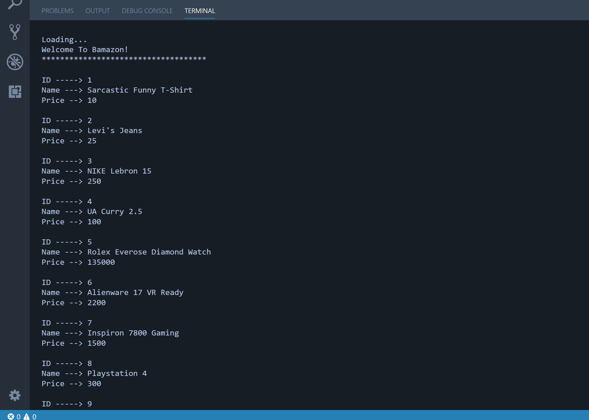
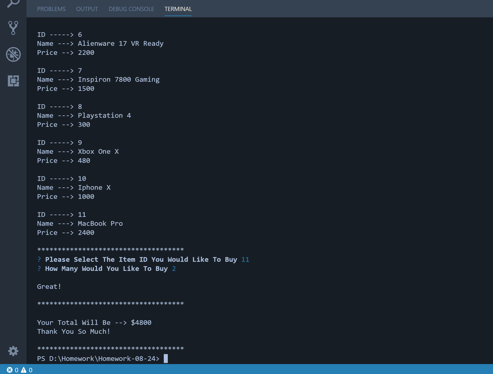
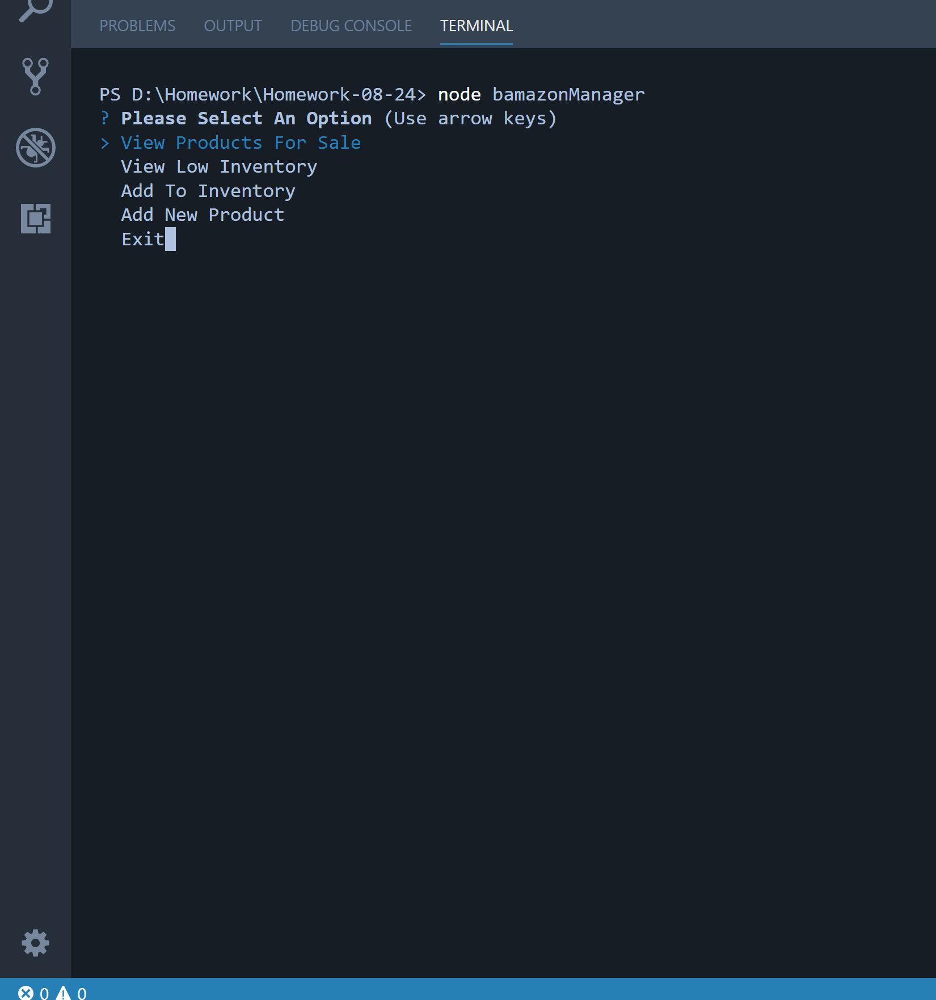
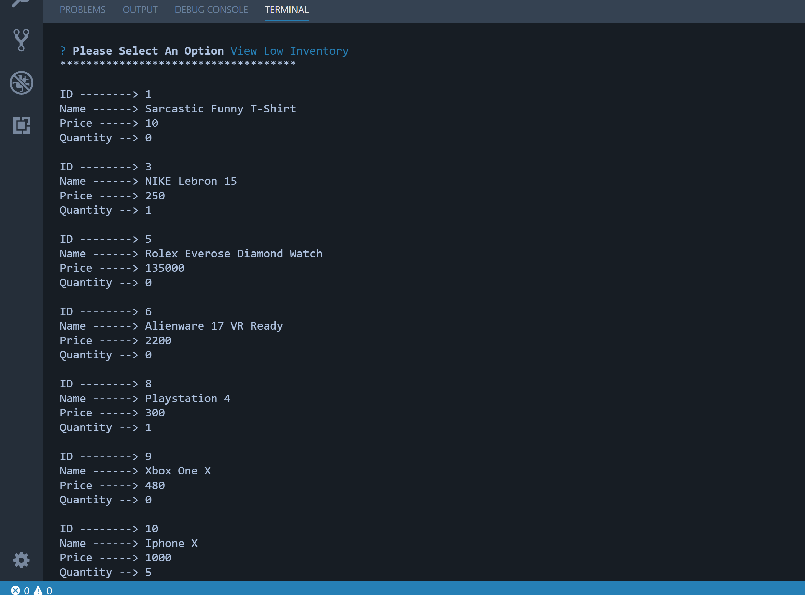
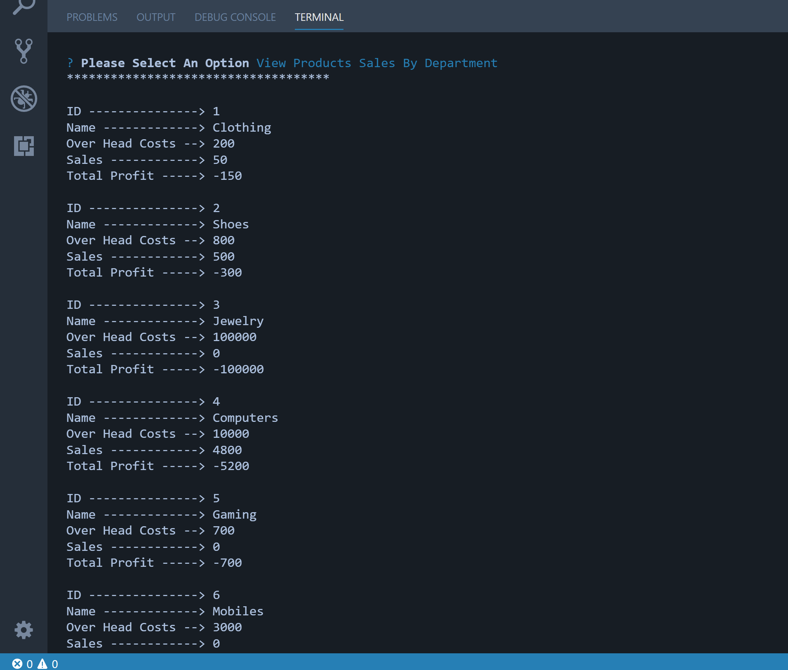

# Bamazon Application

This is my version of a online shopping Node.js application.

### Technologies used:
* Node.js
* MySql
* Javascript
* Inquirer

## Part 1 - BamazonCustomer
In this part of the application you will be the customer, you will be able to see a list of products(stored in a MySql database), and then using the npm package Inquirer you will be ask for the id of the product you would like to buy and also the quantity.
If the product is found on the list and the quantity is available, you will see a message with the total of the purchase, if not it will be displayed a message and the session will end.

## Part 2 - BamazonManager
In this part of the application you will be the manager, at first using Inquirer you will be able to see a menu with a couple of options like adding new products, viewing the products that have a low inventory, adding a new amount to a specific product.

## Part 3 - BamazonSupervisor
In this part of the application you will be the supervisor, you will be able to see the sales by each department, total profit and costs. Everything is linked with the database so you will be able to see the real-time data at the moment.

